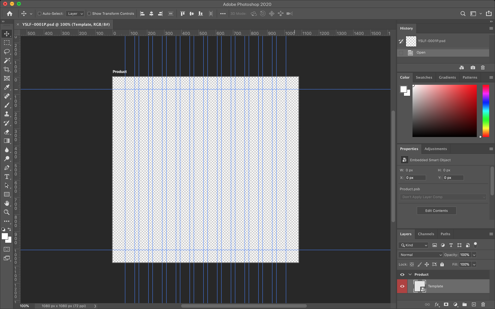
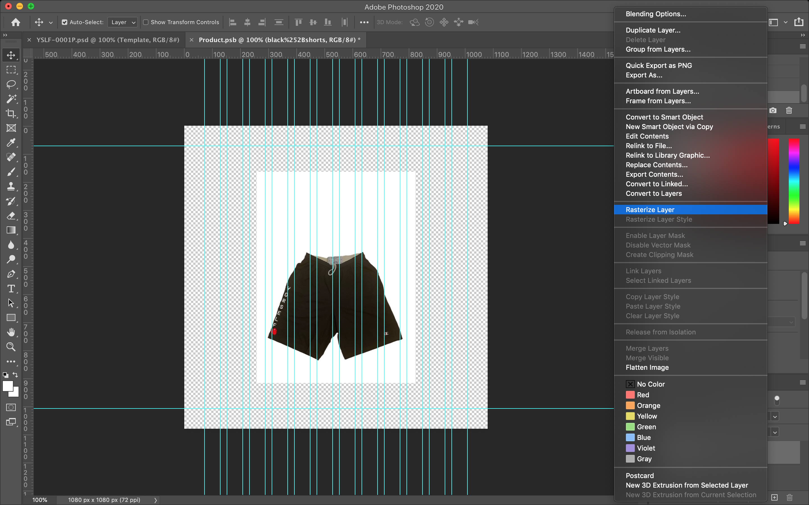
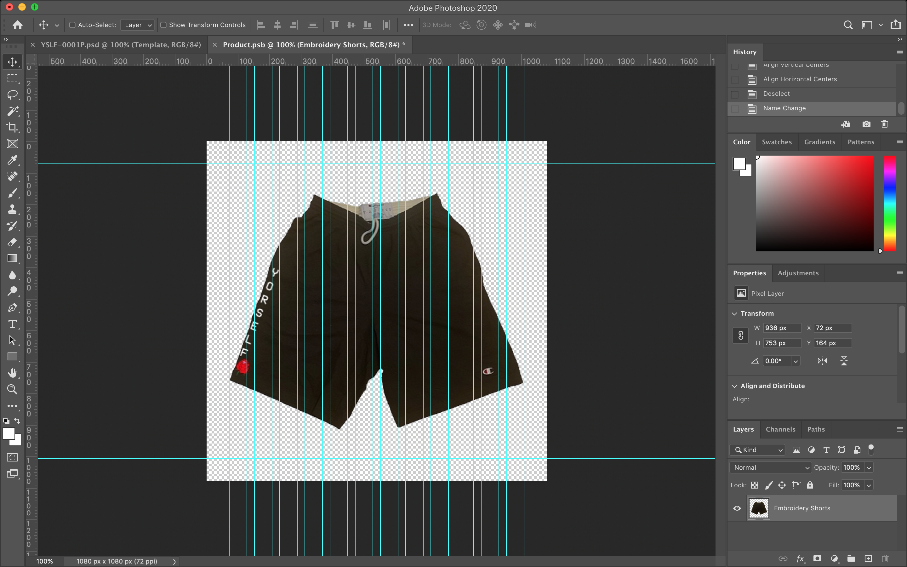
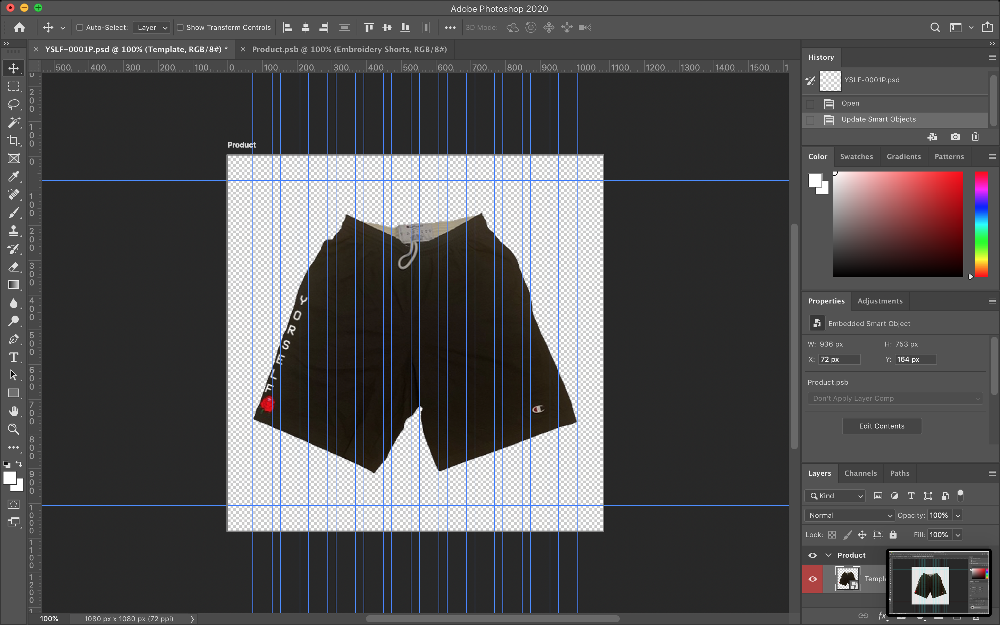

# YORSELF COLLECTION Product Templates

## Overview

[Getting Started](#getting-started)  
[Usage](#usage)  
[Built With](#built-with)

## Getting Started

> [YORSELF COLLECTION][1], promotes the highest form of love; self love. Whatever you
> do in life; wether u find joy and escape in skating like, you cook, you get
> your hands dirty, work a 9-5. Or simply live a fast paced lifestyle... YORSELF
> COLLECTION will always have a piece just right for U.

[1]: https://www.yorselfcollection.com/

## Usage

This Product Template was created in Adobe Photoshop using Smart Objects.

For more information, please visit the [Work with Smart Objects][1] from the
Adobe Photoshop docs.

[1]: https://helpx.adobe.com/photoshop/using/create-smart-objects.html

### Product Templates

**1. Download the Photoshop [template][1]**  

[1]: https://adobe.ly/2TSAArc

**2. **Double click** on the `Template` layer**  

**3. Insert your product image into the `*.psb` file that has opened up**  

To begin adjusting the image, you may need to rasterize the layer. To do this,
right click on your image layer and select "Rasterize Layer".

Additionally, you may want to make the image background transparent.

**4. Resize your image**  
Still working within the `*.psb` layer, proportionally resize your image so that
it is `936px` wide.

In the final template, this will create a gutter of 72px around the image.

In the original template file, you can adjust the Guide Layout to experiement
with different gutter widths.

**5. Save your image**  
Once satisified, save your transformed image and return to the original template
file. Your image will be placed inside the template safe zone and will be ready
for you to export to any format of your choosing.

## Built With

- [Adobe Photoshop][1] - Imaging and graphic design software

[1]: https://www.adobe.com/products/photoshop
